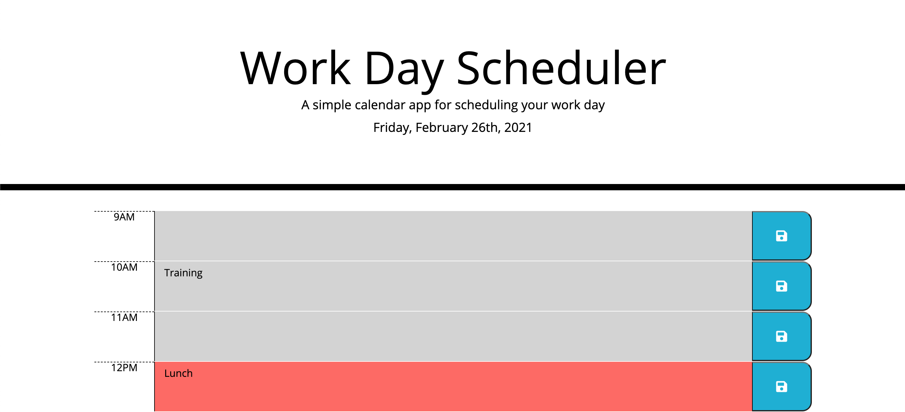
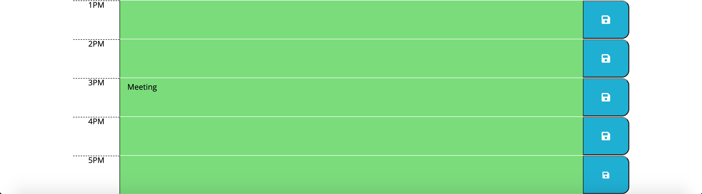

# OSU Bootcamp Homework 5

## Summary

For this project I created a workday scheduler. The current date is displayed at the top of the page. There are blocks for each hour from 9am to 5pm. When the user enters text in the text area the text is saved to the local storage and the entry persists on the page. For the present hour the time block will be red. For the past hours the time blocks will be light grey. For the future hours the time blocks will be green.

---

## Challenges

The biggest challange for me was getting the time block's color to change with the time. I was never able to figure it out. I also had touble getting the local storage to work. I was able to get it working when I figured out that I had to use `JSON.stringify()` and `JSON.parse()` in order to get the the entries to save properly. I also could not figure out how to get the local storage to work for all text areas and save buttons at once, so I had to separate it out and do it for each text area and save button. I created variables, functions, and event listeners for each individual text area and save button.

To get entry from local storage and put in each `<textarea></textarea>`:

```
function init9(){
    let text9 = JSON.parse(localStorage.getItem('text9'));
    textInput9.value = text9;
```

To save each entry to local storage:

```
saveBtn9.addEventListener('click', function(event) {
    event.preventDefault();
    let text9 = document.querySelector('#hour9').value;
    localStorage.setItem('text9',JSON.stringify(text9));
})
```

---

## Things I Improved On

I was able to gain a better understanding of Bootstrap while doing this project. I put this class on each text block to get the look I wanted:

```
<div id="" class="time-block row">
    <p class="col-md-1 hour">9AM</p>
    <textarea id="hour9" class="col-md-10 description past"></textarea>
    <button class="col-md-1 saveBtn9 fas fa-save"></button>
</div>
```

## Screen Shots





---

## Link to Deployed Application

[Link to deployed application](https://www.example.com)
